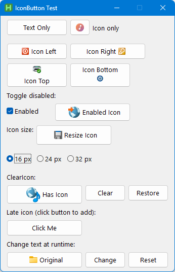

# IconButton Control
[](https://www.autohotkey.com/)
[](https://www.microsoft.com/windows)
[](LICENSE)
[](https://github.com/akcansoft/IconButton/releases)


A lightweight [AutoHotkey v2](https://www.autohotkey.com/) class that adds **icon support** to standard GUI buttons — with automatic DPI scaling, grayscale on disable, and flexible icon positioning.



## ✨ Features

| Feature                   | Description                                                                                                                                                 |
| ------------------------- | ----------------------------------------------------------------------------------------------------------------------------------------------------------- |
| **Icon positioning**      | Place icons to the `left`, `right`, `top`, or `bottom` of the button text. Icon-only buttons are automatically centered.                                    |
| **Automatic DPI scaling** | Logical icon sizes are scaled to the current monitor's DPI. Moving a window to a different-DPI monitor rescales the icon automatically via `WM_DPICHANGED`. |
| **Grayscale on disable**  | Setting `Enabled := false` renders the icon in grayscale using Rec. 601 luminance. Re-enabling restores the original icon instantly.                        |
| **Runtime icon resizing** | Change the icon size at any time with the `IconSize` property — no need to call `SetIcon` again.                                                            |
| **Clear & restore**       | `ClearIcon()` removes the icon and frees all GDI resources. You can re-attach an icon at any time with `SetIcon()`.                                         |
| **Runtime text change**   | Change the button text with `btn.Text := "New Text"` — the icon layout adjusts automatically.                                                               |
| **Drop-in replacement**   | IconButton wraps the native `Gui.Add("Button")` control. All standard button properties, methods, and events work transparently.                            |

---

## 📋 Requirements

- **[AutoHotkey v2.0](https://www.autohotkey.com/)** or later
- **Windows 10+** (uses `GetDpiForWindow`; falls back to `GetDeviceCaps` on older systems)

---

## 🚀 Quick Start

1. Place `IconButton.ahk` in your project folder (or anywhere on your `#Include` path).
2. Include it at the top of your script:

```ahk
#Requires AutoHotkey v2.0
#Include IconButton.ahk
```

3. Create a button with an icon:

```ahk
myGui := Gui(, "My App")
myGui.SetFont("s10", "Segoe UI")

btn := IconButton(myGui, "w150 h36", "Save File")
btn.SetIcon("C:\Windows\System32\shell32.dll", 259, 16, "left")

myGui.Show()
```

---

## 📖 API Reference

### Constructor

```ahk
btn := IconButton(gui, options, text)
```

| Parameter | Type   | Description                                      |
| --------- | ------ | ------------------------------------------------ |
| `gui`     | Gui    | The parent Gui object                            |
| `options` | String | Standard AHK button options (e.g. `"w120 h32"`)  |
| `text`    | String | Button label. Pass `""` for an icon-only button. |

---

### SetIcon()

Attaches or replaces an icon on the button.

```ahk
btn.SetIcon(file, index, size, position)
```

| Parameter  | Type    | Default      | Description                                                                                                    |
| ---------- | ------- | ------------ | -------------------------------------------------------------------------------------------------------------- |
| `file`     | String  | *(required)* | Icon source file — `.dll`, `.exe`, or `.ico`                                                                   |
| `index`    | Integer | `1`          | 1-based icon index within the file                                                                             |
| `size`     | Integer | `16`         | Logical icon size in pixels (DPI-independent)                                                                  |
| `position` | String  | `"left"`     | Icon placement: `"left"`, `"right"`, `"top"`, or `"bottom"`. Ignored for icon-only buttons (icon is centered). |

---

### ClearIcon()

Removes the icon from the button and frees all associated GDI resources. The button reverts to a standard text button.

```ahk
btn.ClearIcon()
```

---

### IconSize Property

Get or set the logical icon size at runtime. Changing this property automatically rescales the icon without a full `SetIcon()` call.

```ahk
currentSize := btn.IconSize     ; get
btn.IconSize := 24              ; set — icon rescales immediately
```

---

### Text Property

Get or set the button text at runtime. The icon layout adjusts automatically.

```ahk
currentText := btn.Text         ; get
btn.Text := "New Label"         ; set — layout updates
```

---

### Enabled Property

Enable or disable the button. When disabled, the icon is rendered in grayscale; when re-enabled, the original icon is restored.

```ahk
btn.Enabled := false            ; icon becomes grayscale
btn.Enabled := true             ; original icon is restored
```

---

### Passthrough

All other properties, methods, and events are forwarded directly to the underlying `Gui.Button` control:

```ahk
btn.OnEvent("Click", (*) => MsgBox("Clicked!"))
btn.Move(100, 200)
btn.GetPos(&x, &y, &w, &h)
hwnd := btn.Hwnd
```

---

## 💡 Usage Examples

### Icon-only button

```ahk
btn := IconButton(myGui, "w40 h32")  ; no text
btn.SetIcon("shell32.dll", 129, 16)
```

### Icon positions

```ahk
btnL := IconButton(myGui, "w120 h32", "Left")
btnL.SetIcon(dll, 28, 16, "left")

btnR := IconButton(myGui, "w150 h32", "Right")
btnR.SetIcon(dll, 45, 16, "right")

btnT := IconButton(myGui, "w120 h48", "Top")
btnT.SetIcon(dll, 82, 16, "top")

btnB := IconButton(myGui, "w120 h48", "Bottom")
btnB.SetIcon(dll, 113, 16, "bottom")
```

### Toggle enabled / disabled (grayscale)

```ahk
btn := IconButton(myGui, "w150 h36", "Toggle Me")
btn.SetIcon(dll, 136, 24, "left")

chk := myGui.Add("Checkbox", "w90 h32", "Enabled")
chk.Value := true
chk.OnEvent("Click", (*) => (btn.Enabled := chk.Value))
```

### Change icon size at runtime

```ahk
btn := IconButton(myGui, "w150 h40", "Resize")
btn.SetIcon(dll, 259, 16, "left")

btn.IconSize := 24   ; instantly resizes to 24 px (logical)
btn.IconSize := 32   ; instantly resizes to 32 px (logical)
```

### Clear and restore icon

```ahk
btn := IconButton(myGui, "w150 h38", "Has Icon")
btn.SetIcon(dll, 139, 32, "left")

btn.ClearIcon()                         ; remove icon
btn.SetIcon(dll, 139, 32, "left")       ; restore icon
```

### Late icon assignment

```ahk
btn := IconButton(myGui, "w150 h32", "Click Me")
btn.OnEvent("Click", (*) => btn.SetIcon(dll, 269, 16, "left"))
```

### Runtime text change

```ahk
btn := IconButton(myGui, "w150 h32", "Original")
btn.SetIcon(dll, 4, 16, "left")

btn.Text := "Changed!"     ; text updates, icon stays
btn.Text := "Original"     ; revert
```

> 💡 See **Examples.ahk** for a complete, runnable demo of all features.

---

## 🔧 Technical Details

### How it works

IconButton uses the Win32 [`BCM_SETIMAGELIST`](https://learn.microsoft.com/en-us/windows/win32/controls/bcm-setimagelist) message to attach an ImageList to the native button control. This provides pixel-perfect icon rendering with full theme support.

### DPI awareness

- Icon sizes are specified in **logical pixels** (DPI-independent).
- On creation, `GetDpiForWindow` resolves the current DPI, and the icon is loaded at the correctly scaled pixel size.
- A `WM_DPICHANGED` listener rebuilds the ImageList whenever the window moves to a monitor with a different DPI.

### Grayscale rendering

When the button is disabled, a grayscale copy of the icon is generated:

1. The icon is drawn into a 32-bit top-down DIB section.
2. Each pixel's RGB values are converted to luminance using the **Rec. 601** formula:
   `Y = 0.299·R + 0.587·G + 0.114·B`
3. The alpha channel is preserved, so transparency works correctly.
4. The result is placed in a separate ImageList and sent to the button.

The grayscale ImageList is lazily initialized on first disable and cached until `SetIcon()` is called again.

### Resource management

All GDI resources (ImageLists, HICONs, DIBs) are properly tracked and freed:
- `ClearIcon()` frees all resources immediately.
- `SetIcon()` destroys old resources before creating new ones.
- `__Delete()` cleans up when the object is garbage-collected.
- The `WM_DPICHANGED` handler is automatically unregistered on destruction.

---

## 👤 Author

**Mesut Akcan**

- GitHub: [akcansoft](https://github.com/akcansoft)
- Blog: [akcansoft.blogspot.com](https://akcansoft.blogspot.com)
- Blog: [mesutakcan.blogspot.com](https://mesutakcan.blogspot.com)
- YouTube: [mesutakcan](https://www.youtube.com/mesutakcan)


